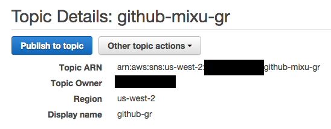
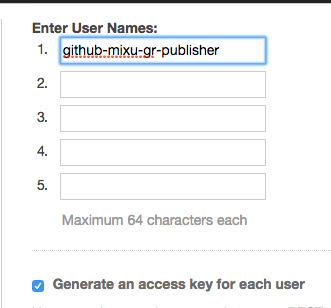
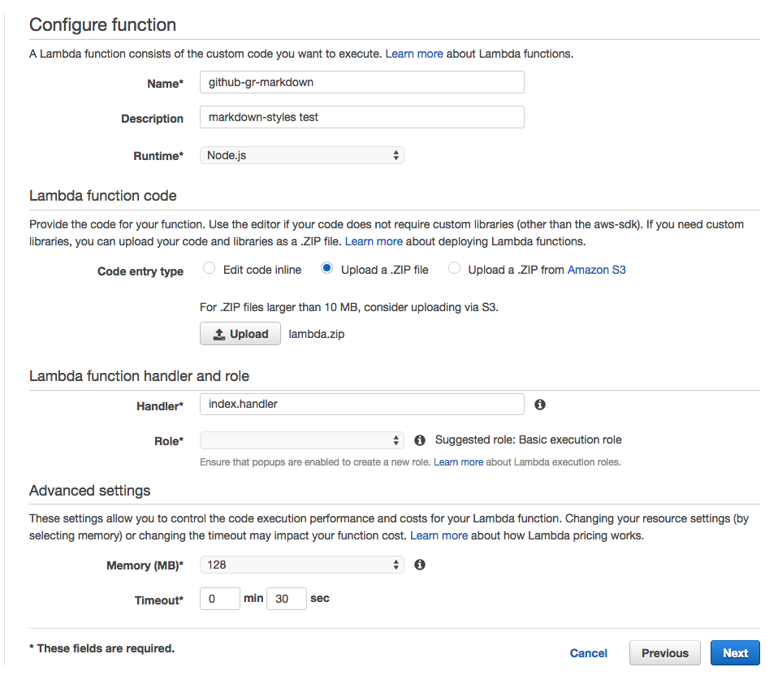

# markdown-styles-lambda

Automatic static site generation on `git push` using AWS Lambda.

## Features

- automatically rebuilds your markdown files stored on Github repos in response to a git push using AWS Lambda.
- includes a full tutorial on how to set up the rebuild, assuming you are already using S3 for static site hosting
- you can use a single AWS Lambda function to process all of your Github repos by configuring the files to process and the layout to use for each repo.
- efficient: only downloads files matching a specific glob pattern on a specific branch rather than cloning the whole repo on each rebuild

## Installation

The installation guide is pretty detailed, and sadly involves a lot of clicking around in the AWS UI. Before we get started, here's what we'll have at end:

```
              Github webhook        SNS event triggers
              sends event to SNS    lambda invocation
git push -> [Github] -> [Amazon SNS] -> [Amazon Lambda] -> [S3 bucket]
                  ^                           |      lambda function
                  \-- .md file(s) downloaded -/      regenerates & uploads
                      via the Github API             HTML files to S3
```

Basically, whenever you push to your Github repo, we'll trigger a rebuild of the markdown files on your Github repo on AWS Lambda. The `markdown-styles-lambda`:

- responds to SNS events from Github
- uses the Github API to query for files that match a specific glob
- downloads those specific files via the Github API (more efficient than cloning a full repo every time)
- rebuilds those markdown files using a specific layout and
- uploads the resulting HTML to S3

Once you've set up this pipeline, you can connect it to multiple Github repos! The same `markdown-styles-lambda` can process events from multiple Github repos - you can configure the layouts and target buckets to use for each repo separately.

I am assuming that you are already using S3 for static site hosting. If you haven't set that up, you'll probably want to take a look at this Amazon tutorial first. Now, let's set this up!

### Create an SNS Topic

1. Go to the [Amazon SNS console](https://console.aws.amazon.com/sns).
2. Click **“Create topic”**.
3. Fill in the name and display name fields with whatever you’d like, then click **“Create topic”**.




Copy the topic ARN for later use.

### Create an IAM User to Publish As

1. Go to [the Amazon IAM console](https://console.aws.amazon.com/iam/home).
2. Click **“Users”** then **“Create New Users”**.
3. Enter a name for the GitHub publisher user. Make sure **“Generate an access key for each user”** is checked.

 

4. Click **“Create”**.
5. Click **“Show User Security Credentials”**, then copy or download the access and secret keys for later use.

  

### Add permissions

1. Return to [the main IAM console page](https://console.aws.amazon.com/iam/home).
2. Click **“Users”**, then click the name of your newly created user to edit its properties.
3. Scroll down to **“Permissions”** and ensure that section is open and that the **“Inline Policies”** section is expanded. Click the link (**“click here”**) to create a new inline policy.

 

4. Select the **“Custom Policy”** radio button, then press **“Select”**.

 

5. Type a name for your policy, then paste the following statements that authorize publication to the SNS topic you created in Step 1 (here’s where you use the topic ARN you were saving). Then click “Apply Policy”.

```
{
  "Version": "2012-10-17",
  "Statement": [
    {
      "Action": [
        "sns:Publish"
      ],
      "Resource": [
        <SNS topic ARN goes here>
      ],
      "Effect": "Allow"
    }
  ]
}
```


### Set up the GitHub Webhook

1. Navigate to your [GitHub](https://github.com/) repo.
2. Click on **“Settings”** in the sidebar.
3. Click on **“Webhooks & Services”**.
4. Click the **“Add service”** dropdown, then click **“AmazonSNS”**.
5. Fill out the form (supplying the IAM user credentials you created in Step 2), then click “Add service”. (Note that the label says “topic”, but it requires the entire ARN, not just the topic name.)


### Create GitHub Credentials

1. Go to [Personal access tokens](https://github.com/settings/tokens) in Github settings.
2. Click **“Generate a personal access token”**.
3. Add a token description, leaving everything else as is, then click **“Generate token”**.
4. Copy the token for later use.


### Set up the code

Get the code: `git clone ...`

Edit `config.js`:

Can I change this more into gulp style?

```
var lambda = require('markdown-styles-lambda').create();

lambda.config('s3', {
  region: ''
});

lambda.config('github', {
  type: 'oauth',
  token: '',
});

lamdba.task('mixu/singlepageapp#master', function(task) {
  // generate markdown
  task.github('/input/*.md')
      .pipe(task.generateMarkdown({
        layout: __dirname + '/layout'
      }))
      .pipe(task.s3('s3://bucket/path'));

  // copy images from /input
  task.github('/input/**/*.png')
      .pipe(task.s3('s3://bucket/path'));
});

if (lambda.identifyGithubEvent(event.Records[0].Sns.Message) === 'PushEvent') {
  lambda.exec(event.Records[0].Sns.Message, context);
}
```

```
{
  AWS: {
    config: {
      region: '',
    },
  },
  github: {
    type: 'oauth',
    token: '',
  },
  builds: [
    {
      user: '',
      repo: '',
      markdown: [
        [ '/input/*.md', 's3://bucket/path']
      ],
      copy: [
        [ '/input/**/*.png', 's3://bucket/path/img']
      ],
      layout: 'github',
    }
  ]
}

```

Configuration properties:

- `AWS.config`: any values that are not empty will be set on [`AWS.config`](http://docs.aws.amazon.com/AWSJavaScriptSDK/guide/node-configuring.html). You'll want to set the region property to match the region of your S3 bucket; the credentials are already set correctly when running a Lambda.
- `github`: the values here will be passed to `github.authenticate`. Set the token to the oAuth token you obtained earlier.
- `builds`: an array of build configurations. These are matched against the incoming SNS message using the `user` and `repo` values; every matching configuration is used to generate the markdown files. You can set multiple builds if you want to share the same `markdown-styles-lambda` across multiple Github repositories.
  - `user`: your Github username
  - `repo`: the name of the repo
  - `markdown`: an array of markdown tasks; files matching these globs will be built using `markdown-styles`
    - for example, to build all files in `input/*.md` and to write them using their paths relative to the github repo's root to `s3://bucket/path`, use `[ '/input/*.md', 's3://bucket/path']`
  - `copy`: an array of copy tasks; files matching these globs will be simply copied over to S3
    - for example, to copy all files in `input/**/*.png` to `s3://bucket/path/`, use `['input/**/*.png', 's3://bucket/path/']`
  - `layout`: a name of a builtin layout or a path relative to the root of the repo to use for the `markdown-styles` tasks

If you want to user your own layout, just point the `layout` to a path relative to the root of the repo.

Note that assets are not automatically uploaded. Run `make upload-assets` to upload the assets.

Now, prepare the zip file for Lambda: `make` (if you are on Windows, just manually run `npm install` and then make a zip file from the root of the git repo).


### Create a Lambda Function

1. Open [the AWS Lambda console](https://console.aws.amazon.com/lambda/home).
2. Click on **“Create a Lambda function”**.
3. Click on **"Upload a .ZIP file"**.

 

4. Set the **Role** to `lambda_s3_exec_role` (this adds the permission for S3)

 

5. Set the **Advanced settings**. 192 MB, 30 seconds recommended just in case, but typically I'm seeing about ~44MB used, and ~8 seconds; but this is network I/O and your files may be different).
6. Click **“Create Lambda function”**.
7. On the Lambda function list page, click the **“Actions”** dropdown then pick **“Add event source”**.

 

8. Select **“SNS”** as the event source type.
9. Choose the SNS topic you created in Step 1, then click **“Submit”**. (Lambda will fill in the ARN for you.)

## Testing your setup

Since there are three systems involved in invoking the lambda, there are three different places where you can trigger an event: the lambda console, the SNS console and the Github webhook UI.

### Testing from the Lambda console


1. In the Lambda console functions list, make sure your GitHub bot function is selected, then choose “Edit/Test” from the Actions dropdown. Choose “SNS” as the sample event type, then click “Invoke” to test your function.

### Testing from the SNS console

2. In the AWS SNS console, open the “Topics” tab, select your GitHub publication topic, then use the “Other topic actions” to select “Delivery status”. Complete the wizard to set up CloudWatch Logs delivery confirmations, then press the “Publish to topic” button to send a test message to your topic (and from there to your Lambda function). You can then go to the CloudWatch Log console to view a confirmation of the delivery and (if everything is working correctly) also see it reflected in the CloudWatch events for your Lambda function and you Lambda function’s logs as well.

### Testing from Github

1. In the “Webhooks & Services” panel in your GitHub repository, click the “Test service” button.
2. Open the AWS Lambda console.
3. In the function list, under “CloudWatch metrics at a glance” for your function, click on any one of the “logs” links.
4. Click on the timestamp column header to sort the log streams by time of last entry.
5. Open the most recent log stream.
6. Verify that the event was received from GitHub.


## Automate maybe???

```
$ aws lambda create-function \
--region us-west-2 \
--function-name CreateThumbnail \
--zip-file fileb://file-path/CreateThumbnail.zip \
--role role-arn \
--handler CreateThumbnail.handler \
--runtime nodejs \
--profile adminuser \
--timeout 10 \
--memory-size 1024

$ aws lambda update-function-configuration \
   --function-name CreateThumbnail  \
   --region us-west-2 \
   --timeout timeout-in-seconds \
   --profile adminuser
```

